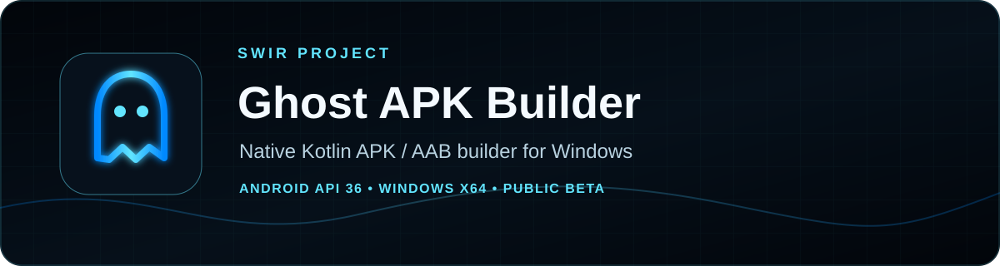
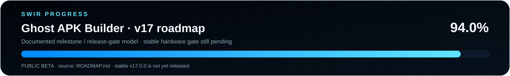

<!-- SWIR-README-STANDARD:v2 -->

 

 

[**Highlights**](#-highlights) · [**Quick Start**](#-quick-start) · [**Roadmap**](#-roadmap) · [**Releases**](#-releases)

## 📍 Project Status

| Item | Current state |
|---|---|
| Current stage | **Public beta** |
| Current public release | [v17.0.0-beta.2](https://github.com/Swir/Ghost-APK-Builder/releases/tag/v17.0.0-beta.2) |
| Target | Native Kotlin Android APK/AAB generation on Windows |
| Roadmap progress | **94%** using the repository's documented v17 milestone/release-gate model |
| Stable gate | **Not complete** — real physical-device verification is still required |

**v17 roadmap progress: 94%.** This value follows the existing authoritative `ROADMAP.md` progress model; it is not recomputed as an equal-weight checkbox percentage and it does not mean stable-ready.

## 🚀 Overview

**Ghost APK Builder v17** is a Windows desktop tool that generates a clean native Kotlin Android project and builds APK/AAB artifacts with a managed toolchain. v17 is a ground-up replacement for the legacy v16.4 architecture, with a bilingual PL/EN desktop workflow, managed build-engine preparation, signing support, project profiles, build history and release-readiness checks.

The current beta has passed its documented software-side release gates, including standalone Windows packaging and Android API 36 build validation. Stable **v17.0.0 is not declared** because the physical Android-device verification gate still needs a successful run on real user hardware.

## ✨ Highlights

| Feature | What it does |
|---|---|
| 🧱 Native project generation | Generates a native Kotlin / Android project instead of depending on a pre-existing Android Studio project |
| 🛠️ Managed Build Engine | Prepares and repairs the supported JDK, Gradle, Android SDK components and bundletool workflow |
| 📦 APK / AAB | Builds Debug/Release APK and AAB artifacts with validation paths |
| 🔐 Signing | Uses session-only signing secrets and supports certificate SHA-1/SHA-256 inspection |
| 🧭 Quick Start | Beginner-oriented dashboard, first-run wizard and Simple/Advanced modes |
| 💾 Project profiles | Saves `.ghostproject` profiles and Recent Projects without persisting signing passwords |
| ✅ Play readiness | Checks package/API/version/signing/icon/output/security conditions before Play submission |
| 🧾 Build History | Stores local artifact metadata including path, size, duration, signing state and SHA-256 |
| 📱 Device verification | Provides an ADB-based one-click APK install/package/launch verification flow; real hardware evidence remains required |
| 🌐 PL / EN | Polish locale starts in Polish; other locales use English fallback, with a persisted manual switch |

## ⚙️ Quick Start

### Recommended — public beta

Download **[v17.0.0-beta.2](https://github.com/Swir/Ghost-APK-Builder/releases/tag/v17.0.0-beta.2)**. The published release includes:

- `Ghost-APK-Builder-v17.0.0-beta.2-Windows-x64.exe`
- a Portable Windows x64 ZIP
- SHA-256 checksum files for the published artifacts

The standalone EXE embeds Python and GUI dependencies. The Portable package also carries the repository's packaged JDK 21, Gradle 9.6 and bundletool 1.18.3 toolchain components. Android SDK components are **not redistributed** in the public archive; Ghost provisions the required official SDK components after explicit Android SDK terms acceptance.

### From source

Use the repository's current Python requirements and development instructions. The public beta is the recommended user path because it is the artifact that passed the documented Windows packaging gates.

## 📋 Requirements / Compatibility

- Primary platform: **Windows x64**.
- Android target profile: **API 36**.
- Current build stack documented by the project: **AGP 9.4 / Gradle 9.6 / JDK 21**.
- Desktop UI is bilingual **Polish / English**.
- A real authorized Android device plus ADB connectivity is required to satisfy the outstanding physical-device verification gate.
- Google/Android SDK licensing still applies to SDK components provisioned by the application.

## 🎮 Workflow

### Simple / Advanced mode

Ghost starts in **Simple** mode for a cleaner first-run workflow. Home and Project stay visible while technical Android, Kotlin, signing, Build Engine and diagnostic tabs are hidden. **Advanced** mode exposes the full toolset and can also be opened automatically when a workflow requires an advanced screen. The preference is persisted.

### Project profiles and Recent Projects

`.ghostproject` files preserve project/application settings and Kotlin source so a project can be reopened. Signing passwords are deliberately excluded. Recent Projects keeps a small deduplicated list of valid project profiles for quick reopening.

### Build and post-build result

Successful builds are recorded locally with artifact path, application/version data, APK/AAB type, Debug/Release mode, signing state, size, duration and SHA-256. The post-build result panel provides actions to open the artifact, open its folder, copy its path/checksum, enter device verification for APKs, or return to Build History for AAB workflows.

### Physical Android-device verification

The one-click APK verification flow uses the managed ADB toolchain to:

1. start/check the ADB server;
2. require exactly one authorized Android device;
3. install with `adb install -r`;
4. verify the package using `pm path`;
5. launch the generated activity with `am start -W`;
6. save a local `device_test_last.json` PASS report.

Unauthorized/offline devices return an actionable failure. **Implementation of this workflow does not complete the release gate by itself**: the roadmap remains incomplete until it succeeds on real user hardware.

## 🧠 Technology / Architecture

| Component | Role |
|---|---|
| `ghost_builder/core.py` | Managed toolchain and private runtime |
| `ghost_builder/model.py` | Project validation |
| `ghost_builder/generator.py` | Deterministic native Android project generation |
| `ghost_builder/builder.py` | Build, signing and artifact validation |
| `ghost_builder/project_store.py` | `.ghostproject` persistence and Recent Projects |
| `ghost_builder/readiness.py` | Google Play readiness checks |
| `ghost_builder/build_history.py` | Local artifact history and SHA-256 metadata |
| `ghost_builder/certificates.py` | Certificate fingerprint parsing |
| `ghost_builder/device_test.py` | Physical-device verification workflow and PASS report |
| `ghost_builder/ui_result.py` | Rich post-build result workflow |
| `ghost_builder/i18n.py` | Polish/English localization |
| `ghost_builder/ui*.py` | Modular desktop UI |

## 🛡️ Safety / Security

Ghost v17 does not globally terminate Java, modify unrelated development tools or persist signing passwords. Signing secrets are kept for the current session and are passed to child processes through the environment where required rather than being stored in project profiles or Build History.

See [SECURITY.md](SECURITY.md) and [THIRD_PARTY_NOTICES.md](THIRD_PARTY_NOTICES.md) for project security and third-party notes.

## 🗺️ Roadmap

The authoritative v17 roadmap is [`ROADMAP.md`](ROADMAP.md). It currently reports **94%** under the project's existing milestone/release-gate model.

The remaining stable-release blocker is the documented **physical Android-device verification on real user hardware**. Stable `v17.0.0` must not be inferred from beta CI or from the 94% display alone.

## 📦 Releases

Current public beta: **[Ghost APK Builder v17.0.0-beta.2](https://github.com/Swir/Ghost-APK-Builder/releases/tag/v17.0.0-beta.2)**.

Its published artifacts include the standalone Windows x64 EXE, a Portable Windows x64 package and SHA-256 checksum files. This README migration does not alter the beta release, tag, version or binaries.

## ⚠️ Current Limitations

- Stable v17.0.0 is **not released**.
- The physical-device release gate still requires successful real-hardware evidence.
- Some roadmap work outside the stable gate remains incomplete, including offline cache import/export, additional template/validation work and richer readiness reporting.
- Android SDK components remain subject to Google's SDK license and are provisioned rather than redistributed in the public package.

## 🔎 Search Keywords

`android apk builder windows` • `android aab builder` • `native kotlin apk generator` • `android api 36 builder` • `windows android build tool` • `managed android sdk toolchain` • `apk signing windows` • `aab signing tool` • `google play readiness checker` • `portable android build environment` • `python desktop android builder` • `bilingual apk builder` • `ghost apk builder`

### `GENERATE • BUILD • SIGN • VERIFY`

⭐ **If Ghost helps your Android workflow, consider leaving a star.**

[**← SWIR profile**](https://github.com/Swir) · [**All projects →**](https://github.com/Swir?tab=repositories)

